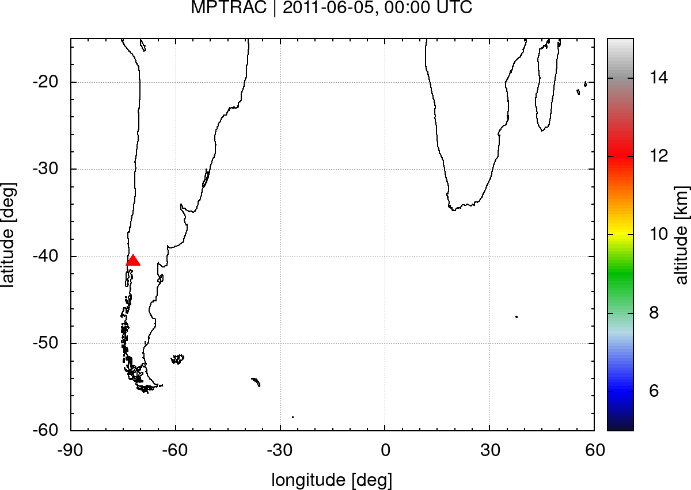
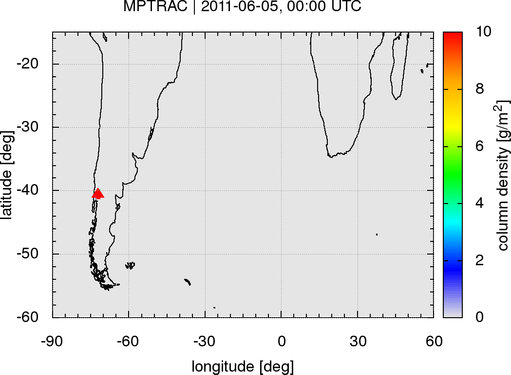
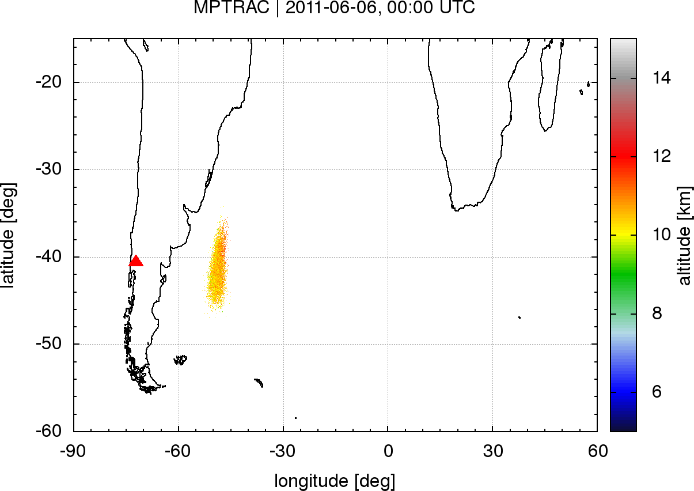
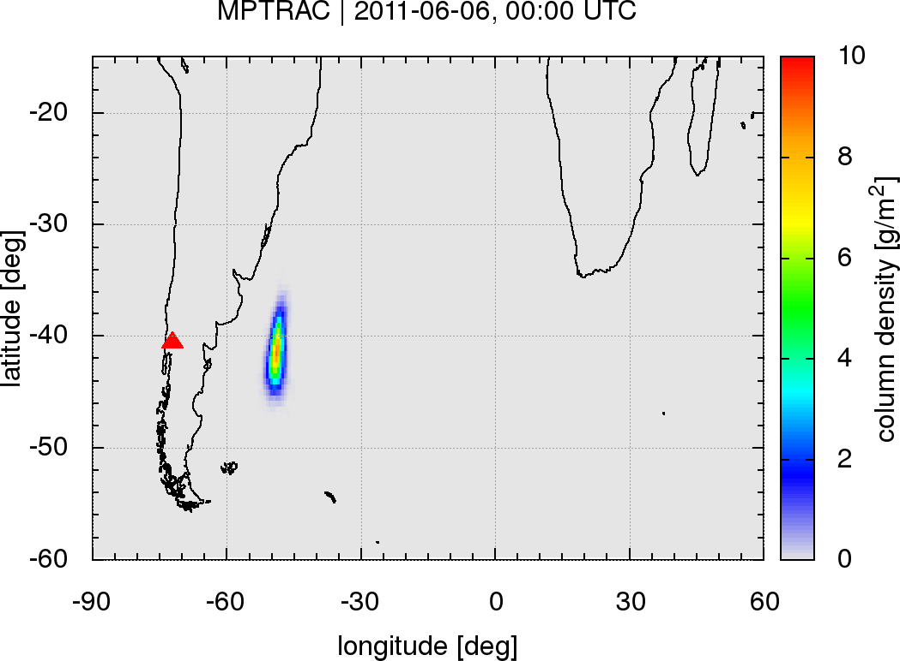
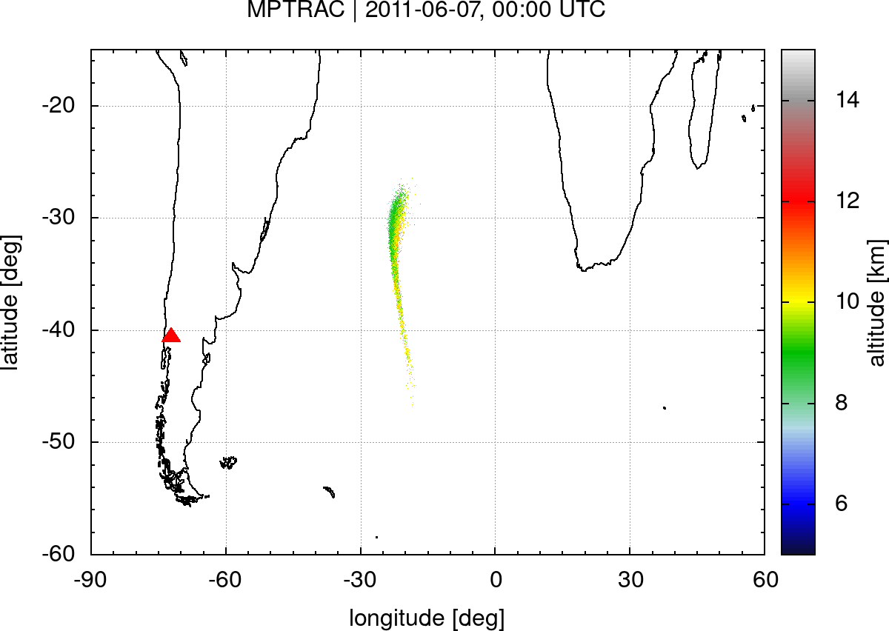
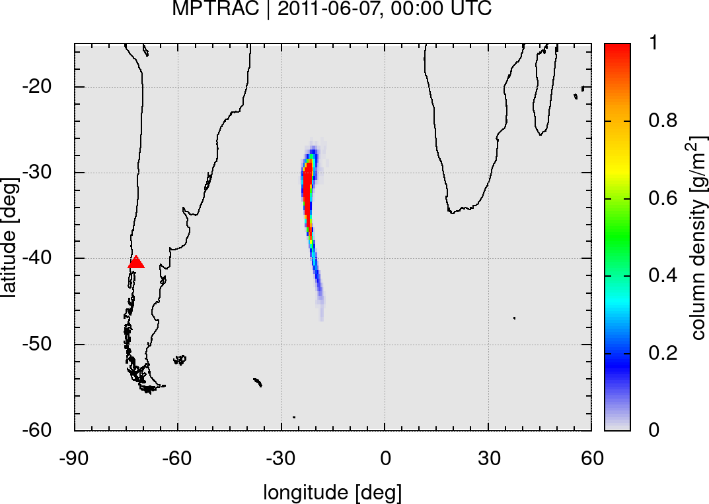
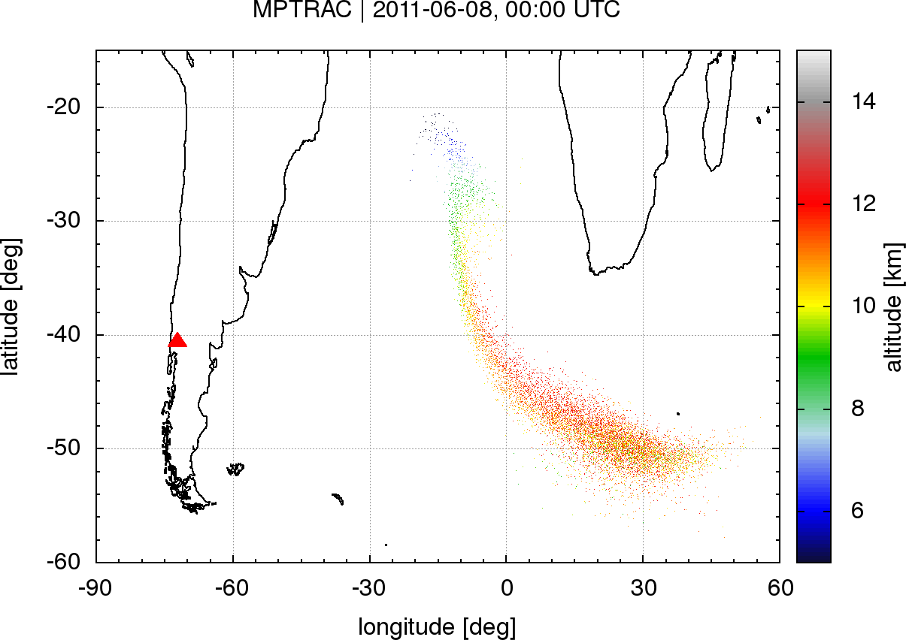

# Massive-Parallel Trajectory Calculations (MPTRAC)

Massive-Parallel Trajectory Calculations (MPTRAC) is a Lagrangian particle dispersion model for the analysis of atmospheric transport processes in the troposphere and stratosphere.

## Features

* MPTRAC calculates air parcel trajectories by solving the kinematic equation of motion using given wind fields.
* Mesoscale diffusion and sub-grid scale wind fluctuations are simulated using a Markov chain model.
* Additional modules are implemented to simulate the sedimentation of particles, the decay of air parcel mass, OH chemistry, and wet deposition.
* Various output methods for particle, ensemble, gridded, and station data. Gnuplot interface for direct visualization.
* MPTRAC features an MPI/OpenMP/OpenACC hybrid parallelization for efficient use on supercomputers and GPUs.

## Getting started

### Prerequisites

This documentation describes the installation of MPTRAC on a Linux system. A number of standard tools (gcc, git, make) and software libraries are needed to install MPTRAC. The [GNU Scientific Library](https://www.gnu.org/software/gsl) is required for numerical calculations and the [Unidata netCDF library](http://www.unidata.ucar.edu/software/netcdf), the [HDF5 library](https://www.hdfgroup.org/solutions/hdf5), and [zlib](http://www.zlib.net/) are needed for file-I/O. Copies of these libraries can be found in the git repository.

Start by downloading the source code from the git repository:

    git clone https://github.com/slcs-jsc/mptrac.git

To update an existing installation use:

    git pull https://github.com/slcs-jsc/mptrac.git

### Installation

First, compile the GSL, netCDF, HDF5, and zlib libraries required by MPTRAC by running the build script:

    cd mptrac/libs
    ./build.sh

Next, change to the source directory, edit the Makefile according to your needs, load any modules as needed on your target platform, and try to compile the code:

    cd mptrac/src
    emacs Makefile
    make

After compilation, the binaries will be located in the mptrac/src/ directory.

By default, the binaries will be linked statically, i.e., they can be copied and run on other machines. However, sometimes static compilations causes problems, in particular in combination with MPI and OpenACC, as static versions of some libraries might be missing. In this case, remove the '-static' flag from the CFLAGS in the Makefile and compile again. To run dynamically linked binaries, the LD_LIBRARY_PATH needs to be set to include the mptrac/libs/build/lib directory.

By default we use rather strict compiler warnings to catch problems. All warning messages will be turned into errors and no binaries will be produced. This behavior is enforced by the flag '-Werror'. It should not be removed from the Makefile.

### Try the example

An example is provided, illustrating how to simulate the dispersion of volcanic ash from the eruption of the Puyehue-Cordón Caulle volcano, Chile, in June 2011.

It is recommended that you create a project directory for testing the example and also to store other experiments:

    mkdir -p mptrac/projects

This shows how to run the example:

    cp -a mptrac/example mptrac/projects
    cd mptrac/projects/example
    ./run.sh

Please see the example script (run.sh) on how to invoke MPTRAC programs such as 'atm_init' and 'atm_split' to initialize trajectory seeds and 'trac' to calculate the trajectories.

The script generates a number of plots of the simulation output at different times after the eruption by means of 'gnuplot'. These plots should look similar to the output already provided in the repository.

This is an example showing the particle position and grid output for 5-8 June 2011:

 &ndash;

 &ndash; 

 &ndash; 

 &ndash; 

## Further information

More detailed information for new users and developers is collected in the [GitHub wiki](https://github.com/slcs-jsc/mptrac/wiki), the [reference manual](https://github.com/slcs-jsc/mptrac/blob/master/docs/refman.pdf), and the [Sphinx documentation](http://griessbach1.pages.jsc.fz-juelich.de/mptrac-user-documentation).

This is the main reference for citing the MPTRAC model in scientific publications:

* Hoffmann, L., T. Rößler, S. Griessbach, Y. Heng, and O. Stein, Lagrangian transport simulations of volcanic sulfur dioxide emissions: Impact of meteorological data products, J. Geophys. Res. Atmos., 121, 4651-4673, https://doi.org/10.1002/2015JD023749, 2016. 

This is a list of selected papers in which MPTRAC was applied:

* Hoffmann, L., Günther, G., Li, D., Stein, O., Wu, X., Griessbach, S., Heng, Y., Konopka, P., Müller, R., Vogel, B., and Wright, J. S.: From ERA-Interim to ERA5: the considerable impact of ECMWF's next-generation reanalysis on Lagrangian transport simulations, Atmos. Chem. Phys., 19, 3097-3124, https://doi.org/10.5194/acp-19-3097-2019, 2019.

* Wu, X., Griessbach, S., and Hoffmann, L.: Long-range transport of volcanic aerosol from the 2010 Merapi tropical eruption to Antarctica, Atmos. Chem. Phys., 18, 15859-15877, https://doi.org/10.5194/acp-18-15859-2018, 2018.

* Rößler, T., Stein, O., Heng, Y., Baumeister, P., and Hoffmann, L.: Trajectory errors of different numerical integration schemes diagnosed with the MPTRAC advection module driven by ECMWF operational analyses, Geosci. Model Dev., 11, 575-592, https://doi.org/10.5194/gmd-11-575-2018, 2018.

* Wu, X., Griessbach, S., and Hoffmann, L.: Equatorward dispersion of a high-latitude volcanic plume and its relation to the Asian summer monsoon: a case study of the Sarychev eruption in 2009, Atmos. Chem. Phys., 17, 13439-13455, https://doi.org/10.5194/acp-17-13439-2017, 2017.

* Hoffmann, L., Hertzog, A., Rößler, T., Stein, O., and Wu, X.: Intercomparison of meteorological analyses and trajectories in the Antarctic lower stratosphere with Concordiasi superpressure balloon observations, Atmos. Chem. Phys., 17, 8045-8061, https://doi.org/10.5194/acp-17-8045-2017, 2017.

* Heng, Y., Hoffmann, L., Griessbach, S., Rößler, T., and Stein, O.: Inverse transport modeling of volcanic sulfur dioxide emissions using large-scale simulations, Geosci. Model Dev., 9, 1627-1645, https://doi.org/10.5194/gmd-9-1627-2016, 2016.

## Contributing

We are interested in sharing MPTRAC for operational or research applications.

Please do not hesitate to contact us, if you have any further questions or need support.

## License

MPTRAC is distributed under the GNU GPL v3.

## Contact

Dr. Lars Hoffmann  

Jülich Supercomputing Centre, Forschungszentrum Jülich

e-mail: l.hoffmann@fz-juelich.de

website: https://www.fz-juelich.de/ias/jsc/slcs
