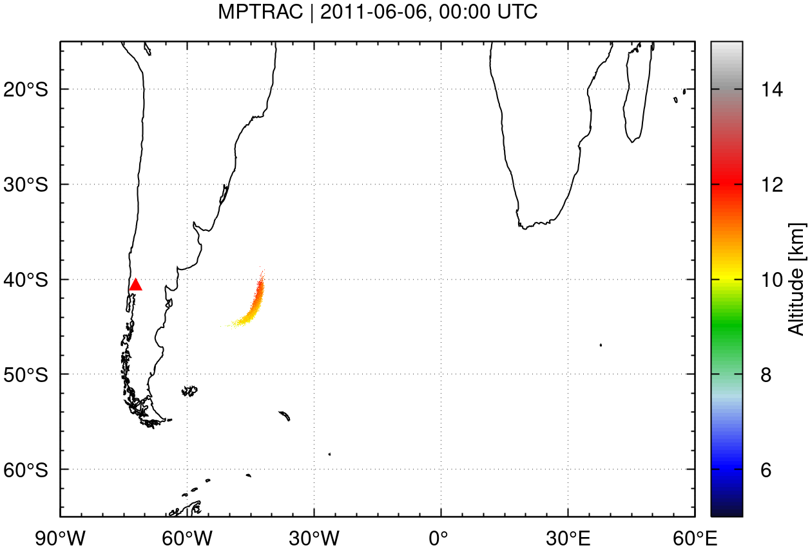
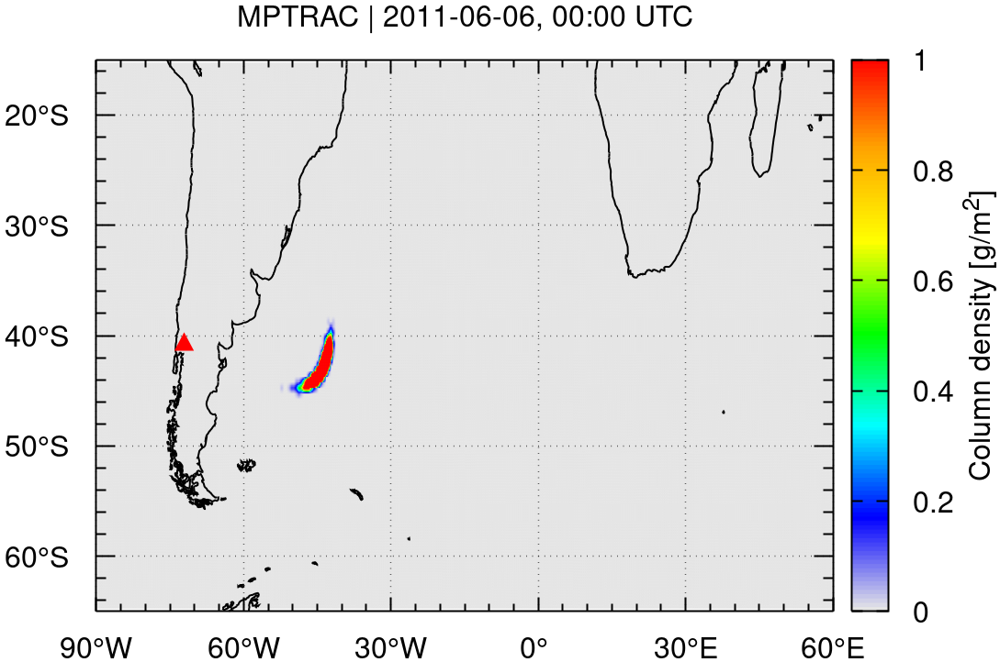
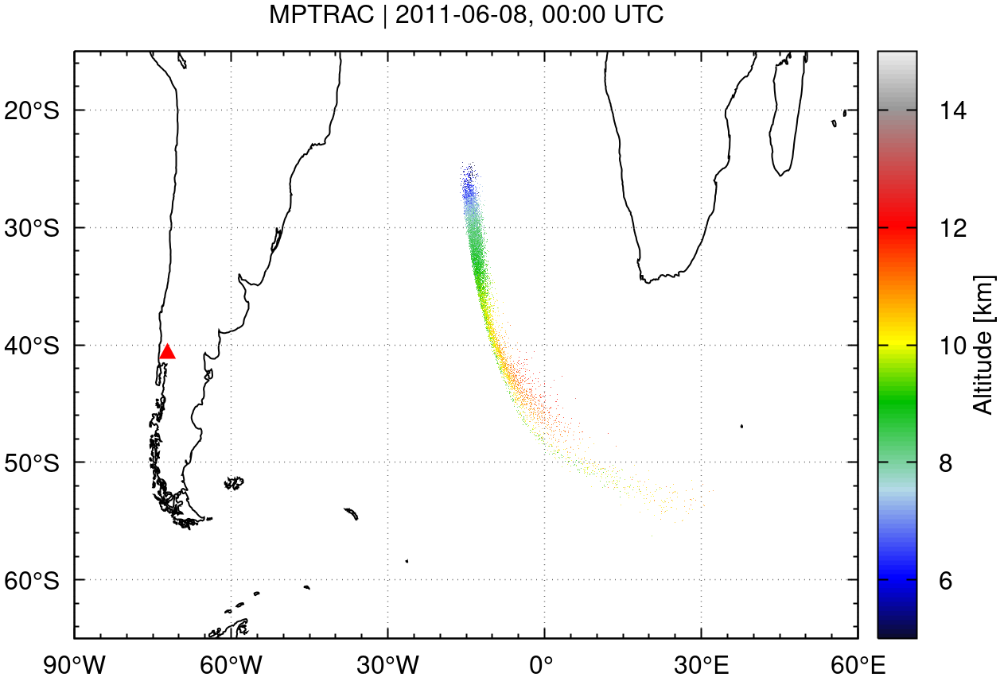
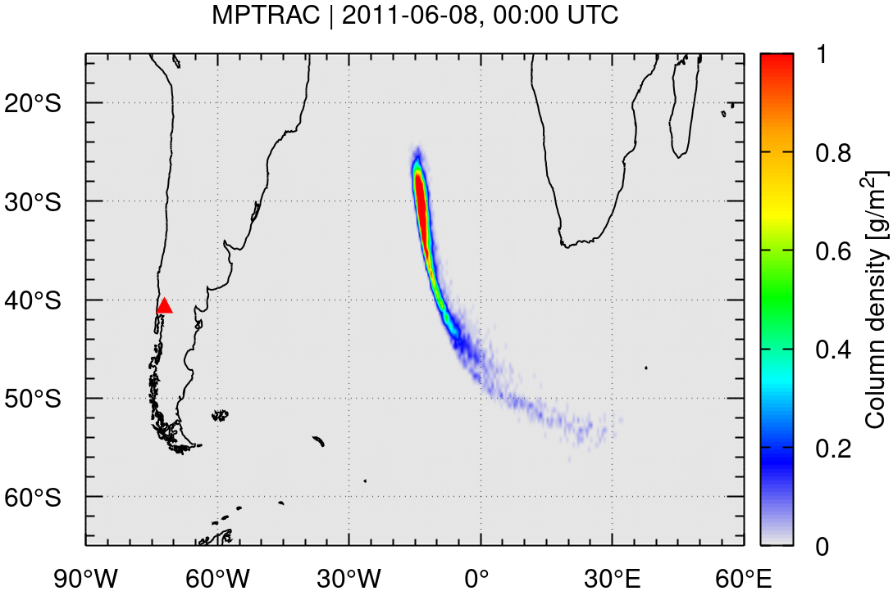

# Massive-Parallel Trajectory Calculations

Massive-Parallel Trajectory Calculations (MPTRAC) is a Lagrangian particle dispersion model for the analysis of atmospheric transport processes in the free troposphere and stratosphere.

## Features

* MPTRAC calculates air parcel trajectories by solving the kinematic equation of motion using given horizontal wind and vertical velocity fields from global reanalyses or forecasts.
* Mesoscale diffusion and subgrid-scale wind fluctuations are simulated using the Langevin equation to add stochastic perturbations to the trajectories. A new inter-parcel exchange module represents mixing of air.
* Additional modules are implemented to simulate convection, sedimentation, exponential decay, gas and aqueous phase chemistry, and wet and dry deposition.
* Meteorological data pre-processing code provides estimates of the boundary layer, convective available potential energy, geopotential heights, potential vorticity, and tropopause data.
* Various output methods for particle, grid, ensemble, profile, sample, and station data. Gnuplot and ParaView interfaces for visualization.
* MPI-OpenMP-OpenACC hybrid parallelization and distinct code optimizations for efficient use from single workstations to HPC and GPU systems.
* Distributed open source under the terms of the GNU GPL.

## Getting started

### Prerequisites

To build and run MPTRAC, you will need some basic tools and libraries, including Git, GNU Make, GCC, GSL, HDF5, netCDF, Szip, and zlib. For additional features such as high-performance computing (HPC) and GPU support, optional dependencies like OpenMPI and NVIDIA HPC SDK are required.

Some of the required dependencies are included with the MPTRAC repository. See the next section for more details.

For a complete list of dependencies, including specific versions and installation instructions, refer to the [dependencies file](https://github.com/slcs-jsc/mptrac/blob/master/dependencies.md).

### Installation

To install MPTRAC, follow these steps:

**1. Download MPTRAC**

Get the latest or a previous version from the [MPTRAC releases](https://github.com/slcs-jsc/mptrac/releases) page. After downloading, extract the release file:

    unzip mptrac-x.y.zip

Alternatively, to get the latest development version, clone the GitHub repository:

    git clone https://github.com/slcs-jsc/mptrac.git

**2. Install required libraries**

MPTRAC includes several libraries that can be compiled and installed using a build script:

    cd [mptrac_directory]/libs
    ./build.sh -a

Alternatively, if you prefer to use existing system libraries, install the dependencies manually. On Ubuntu, run:

    sudo apt-get install gnuplot libgsl-dev libnetcdf-dev libhdf5-dev

**3. Configure the Makefile**

Navigate to the source directory and adjust the `Makefile` as needed:

    cd [mptrac_directory]/src
    emacs Makefile

Pay special attention to the following settings:

* Edit the `LIBDIR` and `INCDIR` paths to point to the directories where the GSL, netCDF, and other required libraries are located on your system.

* By default, the MPTRAC binaries are linked dynamically. Ensure that the `LD_LIBRARY_PATH` is properly configured to include the paths to the shared libraries. If you prefer static linking, you can enable it by setting the `STATIC` flag, which allows you to copy and use the binaries on other machines. However, in some cases, either static or dynamic linking may not be feasible or could cause specific issues.

* To enable MPI parallelization in MPTRAC, you must set the `MPI` flag. Additionally, an MPI library, such as OpenMPI, must be installed on your system. To utilize OpenACC parallelization, enable the `GPU` flag, and ensure the NVIDIA HPC SDK is installed to compile the GPU code. OpenMP parallelization is always enabled.

* Some options in the Makefile are labeled as experimental. These features are still under development and may not be fully functional or tested. Use them at your own risk.

**4. Compile and test the installation**

Once the Makefile is configured, compile the code using:

    make [-j]

To verify the installation, run the test suite:

    make check

This will execute a series of tests sequentially. If any test fails, check the log messages for further details.

### Run the example

An example is provided to illustrate how to simulate the dispersion of volcanic ash from the eruption of the Puyehue-Cordón Caulle volcano, Chile, in June 2011.

The example can be found in the `projects/example/` subdirectory. The `projects/` subdirectory can also be used to store the results of your own simulation experiments with MPTRAC.

The example simulation is controlled by a shell script:

    cd [mptrac_directory]/projects/example
    ./run.sh

The `run.sh` script outlines the steps for invoking MPTRAC programs, such as `atm_init` and `atm_split`, to initialize the trajectory seeds, and `trac` to compute the trajectories.

The script generates simulation output in the `examples/data` subdirectory. The corresponding reference data can be found in `examples/data.ref`.

A set of plots of the simulation output at different time steps after the eruption, generated by means of the `gnuplot` plotting tool, can be found in `examples/plots`. The plots should look similar to the output provided in `examples/plots.ref`.

This is an example showing the particle positions and grid output on 6th and 8th of June 2011:

 &emsp; 

 &emsp; 

## Further information

These are the main scientific publications that provide information about MPTRAC:

* Hoffmann, L., Baumeister, P. F., Cai, Z., Clemens, J., Griessbach, S., Günther, G., Heng, Y., Liu, M., Haghighi Mood, K., Stein, O., Thomas, N., Vogel, B., Wu, X., and Zou, L.: Massive-Parallel Trajectory Calculations version 2.2 (MPTRAC-2.2): Lagrangian transport simulations on graphics processing units (GPUs), Geosci. Model Dev., 15, 2731–2762, https://doi.org/10.5194/gmd-15-2731-2022, 2022.

* Hoffmann, L., T. Rößler, S. Griessbach, Y. Heng, and O. Stein, Lagrangian transport simulations of volcanic sulfur dioxide emissions: Impact of meteorological data products, J. Geophys. Res. Atmos., 121, 4651-4673, https://doi.org/10.1002/2015JD023749, 2016. 

Additional references are collected on the [references web page](https://slcs-jsc.github.io/mptrac/references/).

More detailed information for users of MPTRAC is provided in the [user manual](https://slcs-jsc.github.io/mptrac).

Information for developers of MPTRAC can be found in the [doxygen manual](https://slcs-jsc.github.io/mptrac/doxygen).

For additional information, please also refer to the [wiki](https://github.com/slcs-jsc/mptrac/wiki).

## Contributing

We are committed to supporting both operational and research applications with MPTRAC.

If you encounter any issues or have feature requests, please submit them on the [issue tracker](https://github.com/slcs-jsc/mptrac/issues).

For code changes or fixes, feel free to submit a [pull requests](https://github.com/slcs-jsc/mptrac/pulls).

For detailed contribution instructions, check out our [contributing guidelines](https://github.com/slcs-jsc/mptrac/blob/master/CONTRIBUTING.md).

If you have any questions or need assistance, don't hesitate to reach out to us. We are happy to help!

## License

MPTRAC is being developed at the Jülich Supercomputing Centre, Forschungszentrum Jülich, Germany.

MPTRAC is distributed under the terms of the [GNU General Public License v3.0](https://github.com/slcs-jsc/mptrac/blob/master/COPYING).

For information on how to cite the MPTRAC model in scientific publications, please refer to the [citation file](https://github.com/slcs-jsc/mptrac/blob/master/CITATION.cff).

## Contact

Dr. Lars Hoffmann

Jülich Supercomputing Centre, Forschungszentrum Jülich

e-mail: l.hoffmann@fz-juelich.de
