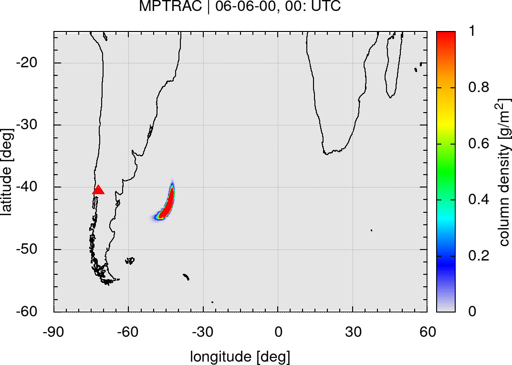
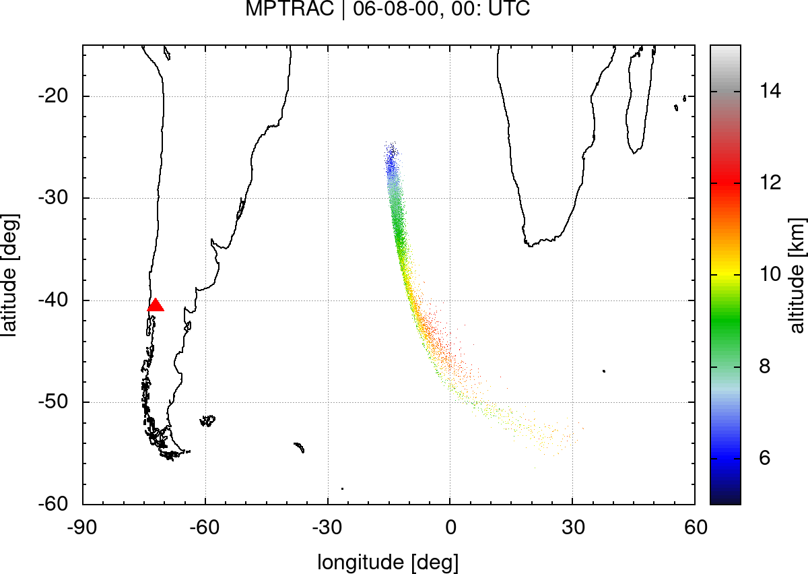
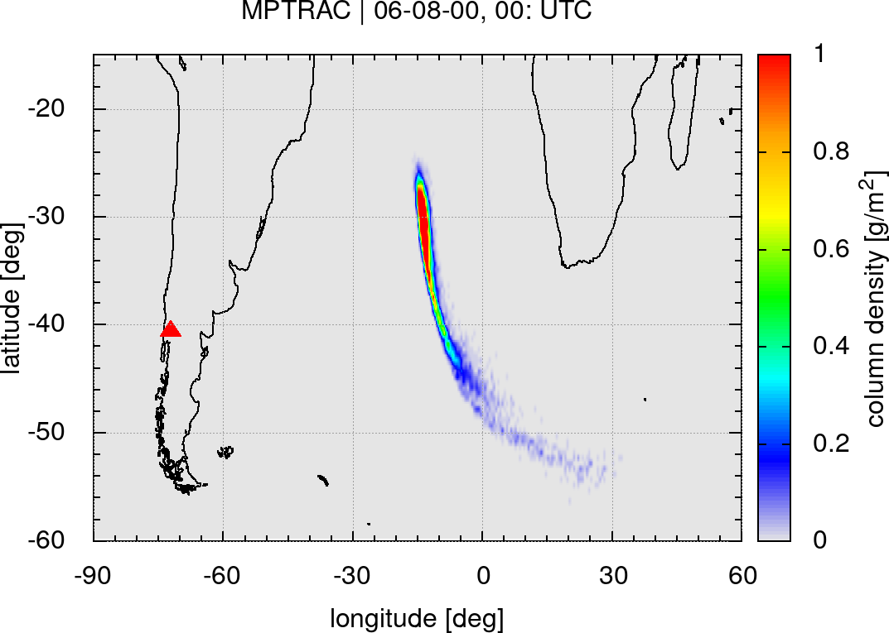

# Massive-Parallel Trajectory Calculations

Massive-Parallel Trajectory Calculations (MPTRAC) is a Lagrangian particle dispersion model for the analysis of atmospheric transport processes in the free troposphere and stratosphere.

## Features

* MPTRAC calculates particle trajectories by solving the kinematic equation of motion using given horizontal wind and vertical velocity fields.
* Mesoscale diffusion and sub-grid scale wind fluctuations are simulated using the Langevin equation to add stochastic perturbations to the trajectories.
* Additional modules are implemented to simulate convection, sedimentation, radioactive decay, hydroxyl chemistry, dry deposition, and wet deposition.
* Various output methods for particle, ensemble, gridded, sample, and station data. Gnuplot interface for direct visualization.
* MPTRAC features an MPI/OpenMP/OpenACC hybrid parallelization for efficient use on HPC and GPU systems.

## Getting started

### Prerequisites

This documentation describes the installation of MPTRAC on a Linux system. A number of standard tools (gcc, git, make) and software libraries are needed to install MPTRAC. The [GNU Scientific Library](https://www.gnu.org/software/gsl) is required for numerical calculations and the [Unidata netCDF library](http://www.unidata.ucar.edu/software/netcdf) is needed for file-I/O. Copies of these libraries are provided in the MPTRAC git repository.

Start by downloading the MPTRAC source code from the git repository:

    git clone https://github.com/slcs-jsc/mptrac.git

To update an existing installation use:

    git pull https://github.com/slcs-jsc/mptrac.git

### Installation

First, compile the GSL and netCDF library required by MPTRAC by running the build script:

    cd mptrac/libs
    ./build.sh <nc2|nc4>

Please select `nc2`, if you want to use meteorological data files in netCDF classic format, or select `nc4`, if you want to be able to use both, netCDF classic and netCDF-4. Compilation of the HDF5 and zlib libraries will be required for netCDF-4.

Next, change to the source directory and edit the Makefile according to your needs.

    cd mptrac/src
    emacs Makefile

In particular, enable or disable the `NC4` flag, depending on whether you want to use netCDF classic or netCDF-4 data files. You may also want to edit the LIBDIR and INCDIR paths to point to the directories where the libraries are located on your system.

To make use of the MPI parallelization of MPTRAC, the MPI flag needs to be enabled in the Makefile. Further steps of the installation will require an MPI library to be installed or loaded as a module. To make use of the OpenACC parallelization, the GPU flag needs to be enabled. The PGI Compiler Suite will be required to compile the GPU code. The OpenMP parallelization of MPTRAC is always enabled.

Load any software modules that might also be needed on your target platform, and try to compile the code:

    make [-j4]

The argument `-j` is optional. It can be used to specify the number of parallel threads to speed up compilation.

After compilation, the MPTRAC binaries are located in the mptrac/src/ directory.

By default, the binaries will be linked statically, i.e., they can be copied to and run on other machines. However, sometimes static compilations causes problems, in particular in combination with MPI and OpenACC. In this case, disable static compilation in the Makefile. To run dynamically linked binaries, the LD_LIBRARY_PATH needs to be set to include the `mptrac/libs/build/lib directory`.

By default we apply rather strict compiler warnings to catch problems. Also, all warning messages will be turned into errors and no binaries will be produced. This behavior is enforced by the flag `-Werror`. It should not be removed from the CFLAGS in the Makefile, unless you know what you are doing.

### Run the example

An example is provided, illustrating how to simulate the dispersion of volcanic ash from the eruption of the Puyehue-Cordón Caulle volcano, Chile, in June 2011.

It is recommended that you create a project directory for testing the example and to store the results also of other experiments:

    mkdir -p mptrac/projects
    cp -a mptrac/example mptrac/projects
    
This shows how to run the example:

    cd mptrac/projects/example
    ./run.sh

At the first call, the run script will download meteorological input data from a data server. This step may take a while as the input data comprise several hundred MByte in size. The input data are saved for later runs and need to be downloaded only once.

Please see the example script (run.sh) on how to invoke MPTRAC programs such as `atm_init` and `atm_split` to initialize trajectory seeds and `trac` to calculate the trajectories.

The script generates a number of plots of the simulation output at different time steps after the eruption by means of `gnuplot`. These plots should look similar to the output already provided in the repository.

This is an example showing the particle position and grid output on 6th and 8th of June 2011:

 &emsp; 

 &emsp; 

## Further information

More detailed information for new users and developers of MPTRAC is collected in the [GitHub wiki](https://github.com/slcs-jsc/mptrac/wiki).

These are the main references for citing the MPTRAC model in scientific publications:

* Hoffmann, L., Baumeister, P. F., Cai, Z., Clemens, J., Griessbach, S., Günther, G., Heng, Y., Liu, M., Haghighi Mood, K., Stein, O., Thomas, N., Vogel, B., Wu, X., and Zou, L.: Massive-Parallel Trajectory Calculations version 2.2 (MPTRAC-2.2): Lagrangian transport simulations on Graphics Processing Units (GPUs), Geosci. Model Dev. Discuss. [preprint], https://doi.org/10.5194/gmd-2021-382, in review, 2021.

* Hoffmann, L., T. Rößler, S. Griessbach, Y. Heng, and O. Stein, Lagrangian transport simulations of volcanic sulfur dioxide emissions: Impact of meteorological data products, J. Geophys. Res. Atmos., 121, 4651-4673, https://doi.org/10.1002/2015JD023749, 2016. 

* You can cite the source code of MPTRAC by using the DOI https://doi.org/10.5281/zenodo.4400597. This DOI represents all versions, and will always resolve to the latest one. Specific DOIs for each release of MPTRAC can be found on the zenodo web site.

Please see the [citation file](https://github.com/slcs-jsc/mptrac/blob/master/CITATION.cff) for further information.

## Contributing

We are interested in sharing MPTRAC for operational and research applications. Please do not hesitate to contact us, if you have any further questions or need support.

## License

MPTRAC is distributed under the [GNU General Public License v3.0](https://github.com/slcs-jsc/mptrac/blob/master/COPYING).

## Contact

Dr. Lars Hoffmann

Jülich Supercomputing Centre, Forschungszentrum Jülich

e-mail: l.hoffmann@fz-juelich.de

website: https://www.fz-juelich.de/ias/jsc/slcs
