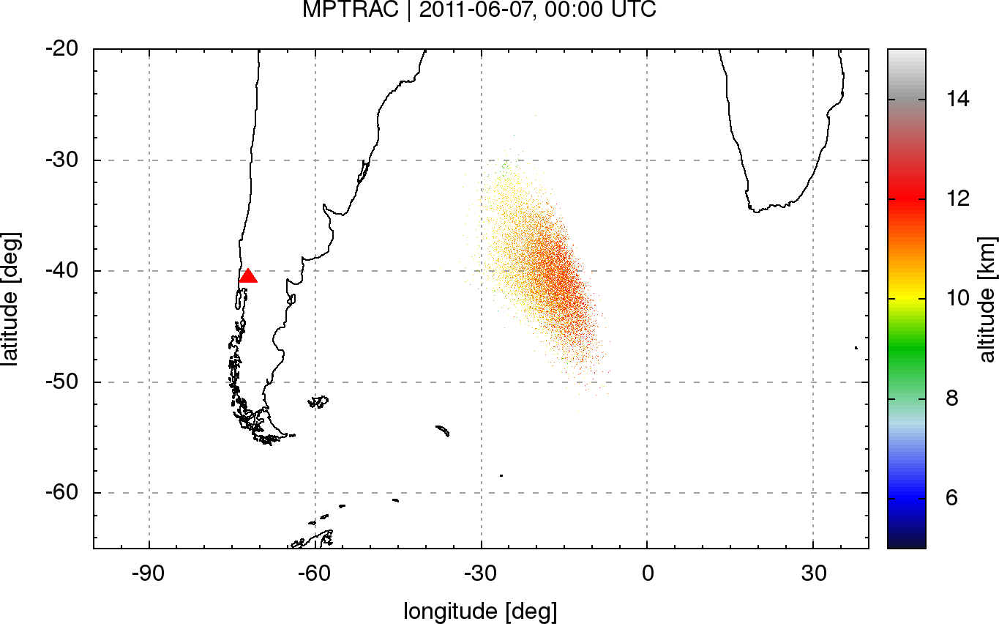
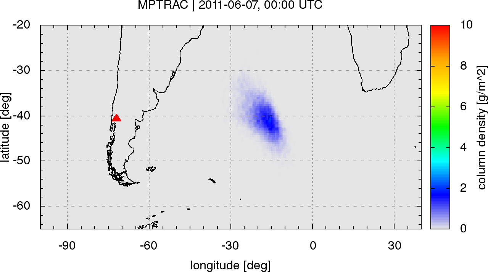

# Massive-Parallel Trajectory Calculations (MPTRAC)

Massive-Parallel Trajectory Calculations (MPTRAC) is a Lagrangian particle dispersion model for the analysis of atmospheric transport processes in the free troposphere and stratosphere.

## Features

* MPTRAC calculates air parcel trajectories by solving the kinematic equation of motion using given wind fields.
* Mesoscale diffusion and sub-grid scale wind fluctuations are simulated using a Markov chain model.
* Additional modules are implemented to simulate the sedimentation of particles and the decay of air parcel mass.
* Various output methods for particle, ensemble, gridded, and station data. Gnuplot interface for direct visualization.
* MPTRAC features an MPI/OpenMP hybrid parallelization for efficient use on supercomputers.

## Getting started

### Prerequisites

This documentation describes the installation of MPTRAC on a Linux system. A number of standard tools (gcc, git, make) and software libraries are needed to install MPTRAC. The [GNU Scientific Library](https://www.gnu.org/software/gsl) is required for numerical calculations and the [Unidata netCDF library](http://www.unidata.ucar.edu/software/netcdf) is needed for file-I/O. Copies of these libraries can be found in the git repository.

Start by downloading the source code from the github repository:

    git clone https://github.com/slcs-jsc/mptrac

To update an existing installation use:

    git pull https://github.com/slcs-jsc/mptrac

### Installation

First, compile the netCDF and GSL libraries needed for MPTRAC by using the build script:

    cd mptrac/lib
    ./build.sh

Next, change to the source directory, edit the Makefile according to your needs, and try to compile the code:

    cd mptrac/src
    emacs Makefile
    make

The binaries will be linked statically, i.e., they can be copied to other machines. Sometimes static compilations causes problems, in particular in combination with MPI. In this case remove the '-static' flag from the CFLAGS in the Makefile and compile again.

By default we use rather strict compiler warnings. All warning messages will be turned into errors and no binaries will be produced. This behavior is enforced by the flag '-Werror'.

The binaries will remain in the src/ directory.

### Try the example

An example is provided, illustrating how to simulate the dispersion of volcanic ash from the eruption of the Puyehue-Cordón Caulle volcano, Chile, in June 2011.

It is recommended that you create a project directory to test the example and also to store other experiments. This shows how to run the example:

    mkdir -p mptrac/projects
    cp -a mptrac/example mptrac/projects
    cd mptrac/projects/example
    ./run.sh

Please see the example script run.sh on how to invoke programs such as atm_init and atm_split to initialize trajectory seeds and trac to calculate the trajectories.

The script generates a number of plots of the simulation output at different times after the eruption by means of 'gnuplot'. These plots should look similar to the output already provided in the repository:

### Further information

More details on the control parameters, data structures, and algorithms can be found in the [MPTRAC reference manual](doc/refman.pdf).

## Contributing

We are interested in sharing MPTRAC for operational or research applications. Please do not hesitate to contact us if you have any further questions.

## License

MPTRAC is distributed under the GNU GPL v3.

## Contact

Dr. Lars Hoffmann  
Jülich Supercomputing Centre
Forschungszentrum Jülich GmbH
e-mail: l.hoffmann@fz-juelich.de
