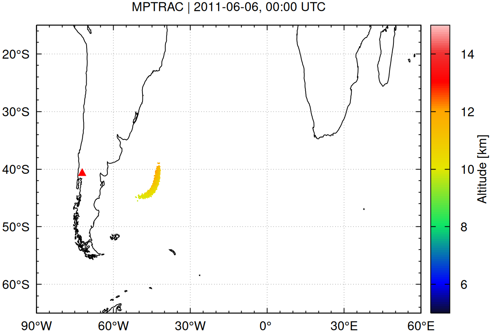

# Massive-Parallel Trajectory Calculations

Massive-Parallel Trajectory Calculations (MPTRAC) is a Lagrangian particle dispersion model for the analysis of atmospheric transport processes in the free troposphere and stratosphere.


[](https://github.com/slcs-jsc/mptrac/releases)
[](https://github.com/slcs-jsc/mptrac/commits/master)
[](https://github.com/slcs-jsc/mptrac/commits/master)
[](https://github.com/slcs-jsc/mptrac/tree/master/src)
[](https://github.com/slcs-jsc/mptrac/tree/master/src)
[](https://github.com/slcs-jsc/mptrac/tree/master/src)
[](https://app.codacy.com/gh/slcs-jsc/mptrac?utm_source=github.com&utm_medium=referral&utm_content=slcs-jsc/mptrac&utm_campaign=Badge_Grade_Settings)
[](https://codecov.io/gh/slcs-jsc/mptrac)
[](https://github.com/slcs-jsc/mptrac/actions)
[](https://slcs-jsc.github.io/mptrac)
[](https://joss.theoj.org/papers/dc49cd7be52f2a47c41cc20143f3719a)
[](https://mptrac.jsc.fz-juelich.de)
[](https://github.com/slcs-jsc/mptrac/blob/master/COPYING)
[](https://doi.org/10.5281/zenodo.4400597)

## Introduction

Massive-Parallel Trajectory Calculations (MPTRAC) is a high-performance Lagrangian particle dispersion model for simulating atmospheric transport in the free troposphere and stratosphere.

Designed for scalability, MPTRAC efficiently handles large-scale trajectory calculations using massive parallelization, making it a valuable tool for studying atmospheric dynamics, pollutant dispersion, and stratospheric transport.

The model accurately tracks air parcels across large spatial and temporal scales by integrating high-resolution meteorological data and accounting for processes such as advection, turbulent diffusion, and meteorological variability.

Applications include long-range pollutant transport, volcanic ash dispersion modeling, stratospheric tracer experiments, and atmospheric chemistry studies. With its focus on performance and precision, MPTRAC enables researchers to better understand and predict complex atmospheric transport phenomena.

## Features

MPTRAC is a powerful tool for atmospheric Lagrangian transport simulations, offering a wide range of features to enhance accuracy, performance, and usability:

- **Advanced Trajectory Calculations**: MPTRAC calculates air parcel trajectories by solving the kinematic equation of motion using horizontal wind and vertical velocity fields from global reanalyses or forecast datasets, enabling precise tracking of atmospheric transport processes in the free troposphere and stratosphere.

- **Stochastic Perturbation and Mixing**: Mesoscale diffusion and subgrid-scale wind fluctuations are simulated using the Langevin equation, introducing stochastic perturbations to trajectories. An inter-parcel exchange module represents mixing of air between neighboring particles, capturing realistic atmospheric dispersion.

- **Comprehensive Process Modeling**: MPTRAC includes modules to simulate convection, sedimentation, exponential decay, gas and aqueous phase chemistry, and wet and dry deposition, allowing for accurate modeling of physical and chemical transformations.

- **Meteorological Data Pre-Processing**: The model pre-processes meteorological data to estimate variables such as boundary layer height, convective available potential energy (CAPE), geopotential heights, potential vorticity, and tropopause data, ensuring seamless integration with diverse datasets.

- **Flexible Output and Visualization**: MPTRAC supports various output formats for particle trajectories, gridded fields, ensemble statistics, vertical profiles, point samples, and station data. Visualization interfaces with Gnuplot and ParaView make it easy to analyze complex data.

- **High-Performance Computing**: The model employs hybrid parallelization using MPI, OpenMP, and OpenACC, allowing efficient utilization of resources from single workstations to HPC clusters and GPU-based systems.

- **Web-Based Accessibility**: The new [MPTRAC Web Runner](https://mptrac.jsc.fz-juelich.de) provides an intuitive, browser-based interface for running trajectory simulations without local installation, making the tool more accessible for educational, research, and operational users.

- **Open Source and Community Driven**: MPTRAC is distributed as open-source software under the GNU General Public License (GPL), promoting collaborative development and ensuring transparency.

## Getting started

### Prerequisites

To build and run MPTRAC, you will need some basic tools and libraries, including Git, GNU Make, GCC, GSL, HDF5, and netCDF.

For additional features such as HPC and GPU support, optional dependencies like OpenMPI and the NVIDIA HPC SDK are required.

Some of the required dependencies are included with the MPTRAC repository. See the next section for more details.

For a complete list of dependencies, including specific versions and installation instructions, refer to the [dependencies file](https://github.com/slcs-jsc/mptrac/blob/master/DEPENDENCIES.md).

### Installation

To install MPTRAC, follow these steps:

**1. Download MPTRAC**

Get the latest or a previous version from the [MPTRAC releases](https://github.com/slcs-jsc/mptrac/releases) page. After downloading, extract the release file:

    unzip mptrac-x.y.zip

Alternatively, to get the latest development version, clone the GitHub repository:

    git clone https://github.com/slcs-jsc/mptrac.git

**2. Install required libraries**

The MPTRAC git repository includes several libraries that can be compiled and installed using a build script:

    cd [mptrac_directory]/libs
    ./build.sh -a

Alternatively, if you prefer to use existing system libraries, install the dependencies manually.

**3. Configure the Makefile**

Navigate to the source directory and adjust the `Makefile` as needed:

    cd [mptrac_directory]/src
    emacs Makefile

Pay special attention to the following settings:

* Edit the `LIBDIR` and `INCDIR` paths to point to the directories where the GSL, netCDF, and other required libraries are located on your system.

* By default, the MPTRAC binaries are linked dynamically. Ensure that the `LD_LIBRARY_PATH` is properly configured to include the paths to the shared libraries. If you prefer static linking, you can enable it by setting the `STATIC` flag, which allows you to copy and use the binaries on other machines. However, in some cases, either static or dynamic linking may not be feasible or could cause specific issues.

* To enable MPI parallelization in MPTRAC, you must set the `MPI` flag. Additionally, an MPI library, such as OpenMPI, must be installed on your system. To utilize OpenACC parallelization, enable the `GPU` flag, and ensure the NVIDIA HPC SDK is installed to compile the GPU code. OpenMP parallelization is always enabled.

* Some options in the Makefile are labeled as experimental. These features are still under development and may not be fully functional or tested. Use them at your own risk.

**4. Compile and test the installation**

Once the Makefile is configured, compile the code using:

    make [-j]

To verify the installation, run the test suite:

    make check

This will execute a series of tests sequentially. If any test fails, check the log messages for further details.

### Running an example simulation

To demonstrate how MPTRAC can simulate the dispersion of volcanic ash, we provide an example based on the eruption of the Puyehue-Cordón Caulle volcano in Chile in June 2011. This example illustrates the setup and execution of a typical simulation.

The example is located in the `projects/example/` subdirectory. You can also use the `projects/` folder to store results from your own simulation experiments with MPTRAC.

Follow these steps to run the example simulation:

1. Navigate to the example directory:

```
    cd [mptrac_directory]/projects/example
```

2. Execute the `run.sh` script to start the simulation:

```
    ./run.sh
```

The `run.sh` script outlines the necessary steps to invoke MPTRAC programs such as `atm_init` (for initializing trajectory seeds), `atm_split` (for splitting particle groups), and `trac` (for computing the trajectories). This script automates the simulation process, ensuring a smooth workflow.

The output of the simulation will be stored in the `projects/example/data` subdirectory. For comparison, reference data is available in the `projects/example/data.ref` folder.

Additionally, the simulation generates several plots at different time steps, which are stored in `projects/example/plots`. These plots show the results of the volcanic plume dispersion over time and can be visualized using the gnuplot plotting tool.

For example, particle positions and grid outputs at different time steps (June 6th and June 8th, 2011) are shown below:

<p align="center"> &emsp; </p>
<p align="center"> &emsp; </p>

### Additional project subdirectories

In addition to the example simulation, MPTRAC provides several utility scripts and resources in the `projects/` directory to support your work:

- `projects/meteo/`: Contains scripts for downloading meteorological input data from various data centers (e.g., ECMWF, NOAA), which are required for trajectory simulations.

- `projects/python/`: Includes Python scripts to read, analyze, and visualize MPTRAC output data, such as air parcel trajectories and gridded fields. These can be helpful for creating custom plots and diagnostics.

- `projects/paraview/`: Provides examples and guidelines for using ParaView to visualize MPTRAC air parcel data in an interactive 3D environment.

These directories offer helpful tools and examples for extending your use of MPTRAC beyond the basic workflow and adapting it to your specific research needs.

## Further information

To learn more about MPTRAC and its scientific background, please refer to the following key publications:

* Hoffmann, L., Baumeister, P. F., Cai, Z., Clemens, J., Griessbach, S., Günther, G., Heng, Y., Liu, M., Haghighi Mood, K., Stein, O., Thomas, N., Vogel, B., Wu, X., and Zou, L.: Massive-Parallel Trajectory Calculations version 2.2 (MPTRAC-2.2): Lagrangian transport simulations on graphics processing units (GPUs), Geosci. Model Dev., 15, 2731–2762, https://doi.org/10.5194/gmd-15-2731-2022, 2022.

* Hoffmann, L., T. Rößler, S. Griessbach, Y. Heng, and O. Stein, Lagrangian transport simulations of volcanic sulfur dioxide emissions: Impact of meteorological data products, J. Geophys. Res. Atmos., 121, 4651-4673, https://doi.org/10.1002/2015JD023749, 2016. 

For a complete list of related publications and references, please visit the [references page](https://slcs-jsc.github.io/mptrac/references/).

The [user manual](https://slcs-jsc.github.io/mptrac) provides detailed instructions on how to install, configure, and run MPTRAC, along with example workflows and practical tips.

Developer-oriented documentation, including code structure and API references, can be found in the [Doxygen manual](https://slcs-jsc.github.io/mptrac/doxygen).

For additional information, please also refer to the [MPTRAC Wiki](https://github.com/slcs-jsc/mptrac/wiki).

## Contributing

We welcome contributions from the community to help improve and expand MPTRAC, supporting both operational and research applications.

If you encounter any issues, bugs, or have suggestions for new features, please let us know by submitting a report on the [issue tracker](https://github.com/slcs-jsc/mptrac/issues). Your feedback helps us make MPTRAC better for everyone.

If you would like to contribute code, fix bugs, or enhance existing features, feel free to submit a [pull request](https://github.com/slcs-jsc/mptrac/pulls). We appreciate well-documented and tested contributions.

Before getting started, please take a moment to read the [contributing guidelines](https://github.com/slcs-jsc/mptrac/blob/master/CONTRIBUTING.md). They include helpful information on setting up your development environment and best practices for submitting contributions.

If you have any questions or need assistance during the process, don't hesitate to reach out. We are happy to help and collaborate!

## License

MPTRAC is developed at the Jülich Supercomputing Centre, Forschungszentrum Jülich, Germany.

The project is made available as open-source software to promote transparency, collaboration, and innovation in atmospheric transport modeling.

MPTRAC is distributed under the terms of the [GNU General Public License v3.0](https://github.com/slcs-jsc/mptrac/blob/master/COPYING). This license ensures that the software remains free and open, while also allowing for modifications and redistribution under the same terms.

If you use MPTRAC in scientific publications or research work, please make sure to cite it appropriately. Detailed citation information can be found in the [citation file](https://github.com/slcs-jsc/mptrac/blob/master/CITATION.cff).

Thank you for supporting open science and helping to advance MPTRAC!

## Contact

For inquiries, support, or collaboration opportunities, please reach out to:

Dr. Lars Hoffmann

Jülich Supercomputing Centre, Forschungszentrum Jülich, Germany

e-mail: l.hoffmann@fz-juelich.de

Feel free to get in touch if you have questions about MPTRAC, need assistance, or are interested in contributing to the project.
