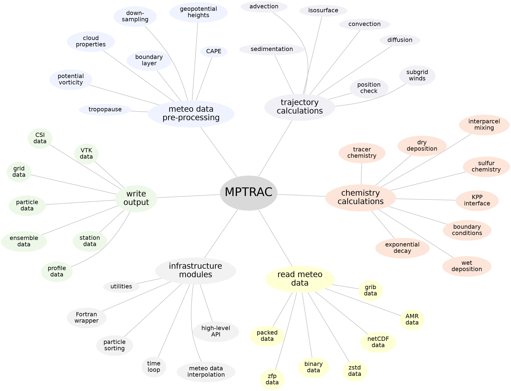

# Summary

The Massive-Parallel Trajectory Calculations (MPTRAC) Lagrangian transport model [@hoffmann16; @hoffmann22] simulates the movement, dispersion, and chemical transformation of aerosols and trace gases in the atmosphere. Unlike traditional grid-based (Eulerian) models, MPTRAC tracks individual air parcel trajectories, providing high-resolution simulations of atmospheric transport processes. The Lagrangian approach enables precise modeling of dispersion, mixing, chemical interactions, and deposition along the trajectories. MPTRAC is driven by meteorological data from weather forecasting models. It has been utilized in various applications, particularly for tracking volcanic plumes in the free troposphere and stratosphere. Optimized for high-performance computing (HPC) and graphics processing unit (GPU) systems, MPTRAC efficiently handles large-scale, high-resolution simulations, making it a powerful tool for atmospheric research, environmental monitoring, and emergency response.

# Statement of need

Accurate atmospheric transport modeling is essential for applications such as air quality assessments, climate studies, and public health protection. Traditional Eulerian models often struggle with fine-scale resolution, limiting their ability to fully capture complex transport and mixing processes. Lagrangian models, such as MPTRAC and others [@mckenna02; @lin03; @stohl05; @jones07; @stein15; @pisso19], address this limitation by tracking individual air parcels, offering a more detailed and flexible representation of dispersion, chemical reactions, and deposition of atmospheric aerosols and trace gases.

MPTRAC is primarily designed for researchers to study atmospheric transport processes, but it also provides added value for operational applications requiring high-precision atmospheric transport simulations. Its ability to model long-range transport and chemical transformations of aerosols and trace gases makes it valuable for studying pollution dispersion, tracking hazardous emissions, and forecasting environmental impacts. In contrast to many other Lagrangian models, MPTRAC is optimized for HPC and GPU systems, enabling fast, large-scale simulations that support real-time decision-making and scientific analysis.

# Features

MPTRAC computes air parcel trajectories using horizontal wind and vertical velocity fields from global reanalysis or forecast data, such as ECMWF's ERA5 [@hersbach20] or NASA's MERRA-2 [@gelaro17] reanalysis. The model accounts for eddy diffusion and subgrid-scale wind fluctuations using the Langevin equation. It incorporates an inter-parcel exchange module to represent air mixing. Additionally, MPTRAC simulates convection, sedimentation, radioactive decay, gas and aqueous phase chemistry, and wet/dry deposition. Meteorological pre-processing routines enable calculations of boundary layer heights, convective available potential energy, geopotential heights, and tropopause data. \autoref{fig:clusters} provides an overview of MPTRAC's geophysical modules and core software components.

{ width=95% }

Optimized for computational efficiency, MPTRAC features an MPI-OpenMP-OpenACC hybrid parallelization for scalable deployment on workstations, HPC systems, and GPU platforms [@liu20; @hoffmann22; @hoffmann24]. It supports a wide range of output formats (ASCII table, netCDF, VTK) for particle, grid, ensemble, profile, sample, and station data, facilitating seamless integration with various data analysis workflows. The results can be directly visualized using tools like Gnuplot and ParaView. MPTRAC is an open-source software distributed under the GNU GPL v3 license. Code and documentation are available in a [GitHub repository](https://github.com/slcs-jsc/mptrac). Software releases are archived on [Zenodo](https://doi.org/10.5281/zenodo.4400597).

# Applications

MPTRAC simulates the transport and dispersion of aerosols and trace gases from both natural and anthropogenic sources. For volcanic eruptions, it helps estimate emissions and track the spread of volcanic ash and sulfate aerosols, which impact air traffic, climate, and ecosystems [@heng16; @wu17; @wu18; @cai22; @mishra22]. Similarly, MPTRAC models the dispersion of carbon dioxide from wildfires, including its ascent into the free troposphere and stratosphere, eventually leading to a well-mixed state throughout the atmosphere [@liao24]. Additional studies examined long-range transport of aerosol and trace gases in the upper troposphere and lower stratosphere [@smoydzin22; @wu23; @clemens24]. These applications are vital for atmospheric research and environmental studies.

An example, shown in \autoref{fig:convection}, illustrates MPTRAC's use in studying convective transport of air from the planetary boundary layer into the free troposphere [@hoffmann23]. The simulation tracks air parcels lifted by updrafts associated with tropical storms and mid-latitude weather systems, revealing how pollutants and aerosols spread over large areas in the more stable free troposphere. This enhances understanding of atmospheric circulation and pollutant distribution on regional to global scales.

{ width=95% }

# Evolution and Future Directions

MPTRAC development began in 2013, designed from the ground up for HPC applications. Initially using OpenMP for multi-core CPUs, it later incorporated MPI for large-scale ensemble simulations. In 2019, OpenACC offloading enabled execution on NVIDIA GPUs, significantly boosting performance. All geophysical modules were subsequently ported to GPUs, optimizing efficiency by minimizing memory data transfers. MPTRAC is now ready for large-scale simulations on the forthcoming Exascale HPC system [JUPITER](https://www.fz-juelich.de/en/ias/jsc/jupiter).

Recent technical efforts focused on enhancing documentation and usability. MPTRAC, written in C, provides a Fortran wrapper and high-level API, enabling seamless integration of Lagrangian transport simulations into other computational models. Continuous testing via GitHub Actions and multiple HPC systems, including the JUPITER Exascale Development Instrument (JEDI), ensures robust performance and reliability.

Future development will expand MPTRAC's applications, particularly in the planetary boundary layer, where turbulence and surface interactions affect transport. Ongoing developments include terrain-following coordinates for better airflow representation over complex topography and advanced turbulence parameterizations for more accurate small-scale transport modeling. These improvements will strengthen MPTRAC's role in studying air quality, pollutant dispersion, and environmental research.

# Acknowledgements

The development of MPTRAC is supported by the Simulation and Data Laboratory Climate Science at the Jülich Supercomputing Centre (JSC) and the Joint Lab Exascale Earth System Modeling of the Helmholtz Association (HGF). We acknowledge JSC for providing essential compute time and storage resources. Financial support for scientific applications and software development has been provided by the DFG project AeroTrac (HO 5102/1-1) and the BMBF project ADAPTEX (FKZ 16ME0670). AI-assisted tools, including ChatGPT and DeepL, were used for language editing of this manuscript.

# References
