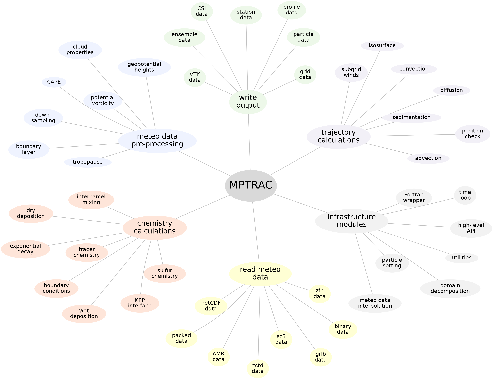

# Welcome to MPTRAC!

Massive-Parallel Trajectory Calculations (MPTRAC) is a state-of-the-art Lagrangian particle dispersion model designed to analyze atmospheric transport processes in the free troposphere and stratosphere. Leveraging high-performance computing techniques, MPTRAC efficiently handles large-scale trajectory simulations, making it a powerful tool for both research and operational applications.

## Features

MPTRAC offers a wide range of features to support comprehensive atmospheric modeling and analysis:

- **Trajectory Calculations**: Computes air parcel trajectories by solving the kinematic equation of motion using specified horizontal wind and vertical velocity fields.

- **Mesoscale Diffusion and Stochastic Perturbations**: Models mesoscale diffusion and sub-grid scale wind fluctuations with the Langevin equation, incorporating stochastic perturbations to enhance simulation realism.

- **Advanced Process Modules**: Simulates a range of atmospheric processes, including convection, sedimentation, exponential decay, gas and aqueous phase chemistry, as well as wet and dry deposition.

- **Meteorological Data Pre-processing**: Provides tools to calculate boundary layer characteristics, convective available potential energy (CAPE), geopotential heights, potential vorticity, and tropopause data.

- **Comprehensive Output and Visualization**: Supports multiple output formats such as particle, ensemble, gridded, sample, and station data. Includes direct visualization through the Gnuplot interface.

- **High-Performance Parallelization**: Leverages MPI-OpenMP-OpenACC hybrid parallelization for efficient execution on workstations, high-performance computing clusters, and GPU systems.

- **Open Source and Collaborative Development**: Released under the GNU General Public License (GPL), promoting community involvement and open development.

## Get Involved

We encourage collaboration and welcome contributions from the research community. Feel free to reach out if you have questions, suggestions, or need support with MPTRAC.

## Contact

Dr. Lars Hoffmann

Jülich Supercomputing Centre, Forschungszentrum Jülich, Germany

e-mail: <l.hoffmann@fz-juelich.de>
