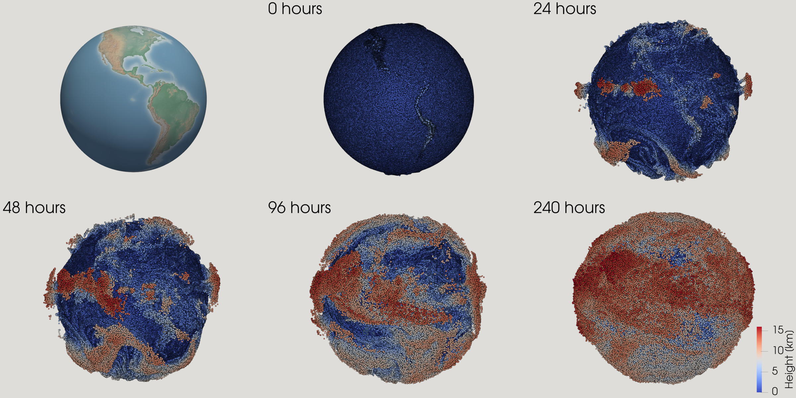

# Welcome to MPTRAC!

Massive-Parallel Trajectory Calculations (MPTRAC) is a Lagrangian
particle dispersion model for the analysis of atmospheric transport
processes in the free troposphere and stratosphere. The model is
designed for execution on parallel computing systems and supports
large ensembles of trajectory simulations for research and operational
applications.

## Features

MPTRAC provides various capabilities for Lagrangian atmospheric
transport simulations, including:

- **Trajectory calculations**: Air parcel trajectories are computed by
  solving the kinematic equation of motion using horizontal wind and
  vertical velocity fields from global reanalysis or forecast datasets.
  Simulations target the free troposphere and stratosphere.

- **Stochastic perturbations and mixing**: Mesoscale diffusion and
  subgrid-scale wind variability are represented using a Langevin
  formulation. An inter-parcel exchange scheme is available to model
  mixing between neighboring particles.

- **Physical and chemical process modules**: Optional parameterizations
  are available for convection, sedimentation, exponential decay,
  gas-phase and aqueous-phase chemistry, and wet and dry deposition.

- **Meteorological data preprocessing**: Meteorological input data can
  be preprocessed to derive variables such as boundary layer height,
  convective available potential energy (CAPE), geopotential height,
  potential vorticity, and tropopause diagnostics.

- **Output and visualization options**: The model supports multiple
  output formats, including particle trajectories, gridded fields,
  ensemble statistics, vertical profiles, point samples, and station
  data. Visualization is supported through interfaces to Gnuplot and
  ParaView.

- **Parallel execution**: MPTRAC supports hybrid parallelization using
  MPI, OpenMP, and OpenACC, enabling execution on systems ranging from
  single workstations to HPC clusters and GPU-enabled platforms.

- **Open-source development**: MPTRAC is distributed under the GNU
  General Public License (GPL) and developed in an open repository,
  allowing users to inspect, modify, and contribute to the codebase.

## Getting Started

Installation instructions are provided in the [installation
guide](installation.md), which describes how to set up MPTRAC on local
systems and HPC environments. The [quick start guide](quickstart.md)
introduces the basic workflow and input structure required to run
simple trajectory simulations, helping new users become familiar with
the model's core functionality and input structure.

MPTRAC can also be run through a browser-based interface, the [MPTRAC
Web Runner](https://mptrac.jsc.fz-juelich.de). This interface allows
users to run simulations without local installation and is commonly
used for teaching, demonstrations, and exploratory studies.

Contributions, questions, and feedback from the research community are
welcome. Further information on development and usage can be found
throughout this manual. If you have questions, feedback, or require
support, please feel free to reach out.

## Contact

Dr. Lars Hoffmann

Jülich Supercomputing Centre, Forschungszentrum Jülich, Germany

e-mail: <l.hoffmann@fz-juelich.de>
