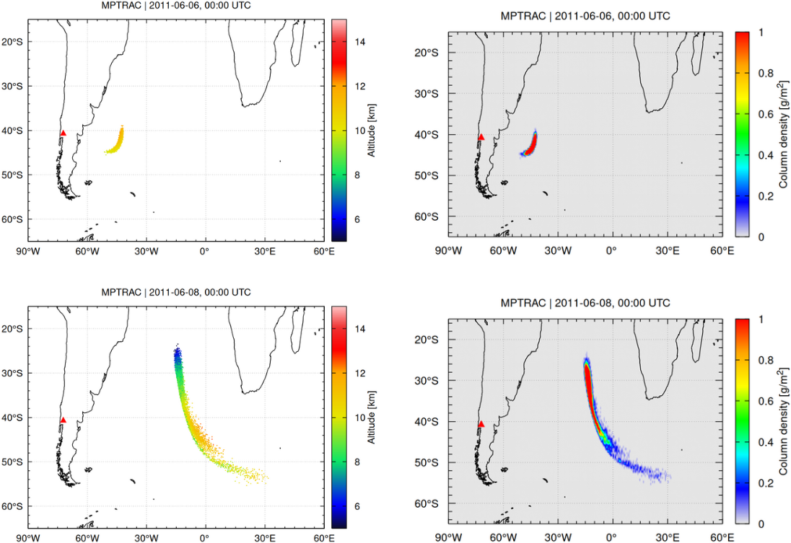

# Quickstart

A simple example is provided, illustrating how to simulate the
dispersion of volcanic ash from the eruption of the Puyehue-Cordón
Caulle volcano, Chile, in June 2011.

## Example of an MPTRAC simulation

The example can be found in the `projects` directory. The `projects`
directory can also be used to store results of other simulation and
experiments with MPTRAC. The simulation is controlled by a shell
script:

    cd mptrac/projects/example
    ./run.sh

Please see the script `run.sh` on how to invoke MPTRAC programs such
as `atm_init` and `atm_split` to initialize trajectory seeds and
`trac` to calculate the trajectories.

The script generates a number of plots of the simulation output at
different time steps after the eruption by means of the `gnuplot`
graphing tool. These plots should look similar to the output already
provided in the repository.

This is an example showing the particle output on 6th to 8th of June
2011:

## Additional project subdirectories

In addition to the example simulation, MPTRAC provides several utility scripts and resources in the `projects/` directory to support your work:

- `projects/meteo/`: Contains scripts for downloading meteorological input data from various data centers (e.g., ECMWF, NOAA), which are required for trajectory simulations.

- `projects/python/`: Includes Python scripts to read, analyze, and visualize MPTRAC output data, such as air parcel trajectories and gridded fields. These can be helpful for creating custom plots and diagnostics.

- `projects/paraview/`: Provides examples and guidelines for using ParaView to visualize MPTRAC air parcel data in an interactive 3D environment.

These directories offer helpful tools and examples for extending your use of MPTRAC beyond the basic workflow and adapting it to your specific research needs.

## Further information

More detailed information for new users and developers of MPTRAC is
provided in the [user manual](https://slcs-jsc.github.io/mptrac/), the
[Doxygen manual](https://slcs-jsc.github.io/mptrac/doxygen), and in
the [GitHub wiki](https://github.com/slcs-jsc/mptrac/wiki).

For an in-depth description of the MPTRAC model, including its
architecture, features, and GPU-based performance optimization, please
refer to the following publication:

> Hoffmann, L., Baumeister, P. F., Cai, Z., Clemens, J., Griessbach, S.,
> Günther, G., Heng, Y., Liu, M., Haghighi Mood, K., Stein, O., Thomas,
> N., Vogel, B., Wu, X., and Zou, L.: Massive-Parallel Trajectory
> Calculations version 2.2 (MPTRAC-2.2): Lagrangian transport
> simulations on graphics processing units (GPUs), Geosci. Model Dev.,
> 15, 2731–2762, <https://doi.org/10.5194/gmd-15-2731-2022>, 2022.

A concise overview and introduction to MPTRAC is available in this
open-access article:

> Hoffmann, L., Clemens, J., Griessbach, S., Haghighi Mood, K., Heng,
> Y., Khosrawi, F., Liu, M., Lu, Y.-S., Meyer, C., Nobre Wittwer, N.,
> Wu, X., Zou, L., MPTRAC: A high-performance Lagrangian transport
> model for atmospheric air parcel dispersion, Journal of Open Source
> Software, 10(111), 8177, <https://doi.org/10.21105/joss.08177>, 2025.

For a complete list of related publications and references, please
visit the [MPTRAC references page](https://slcs-jsc.github.io/mptrac/references/).

We are interested in sharing MPTRAC for operational and research
applications. Please do not hesitate to contact us, if you have any
further questions or need support.
