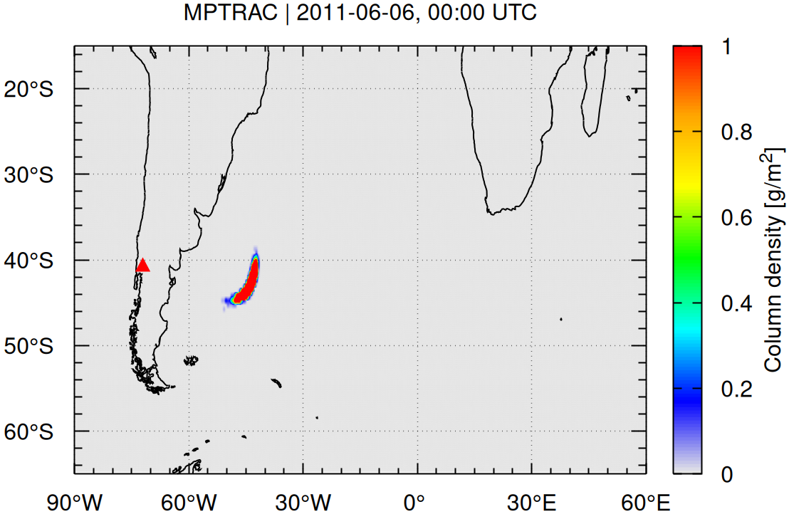
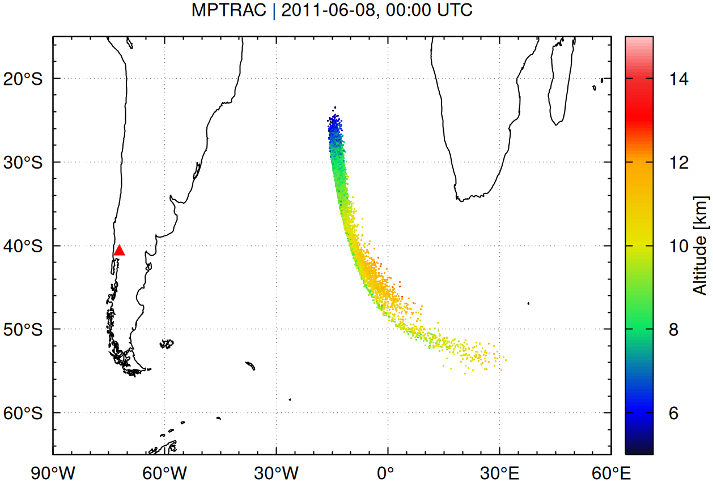

# MPTRAC Quick Start Example

This is a simplified example to help you **run your first simulation** using the [MPTRAC](https://github.com/slcs-jsc/mptrac) Lagrangian transport model, assuming you have successfully installed and built the software.

## Run the Example Simulation

This example demonstrates the dispersion of volcanic ash from the Puyehue-Cordón Caulle eruption in June 2011 using MPTRAC.

### Steps

1. Navigate to the example directory:

   ```bash
   cd [mptrac_directory]/projects/example
   ```

2. Run the example simulation:

   ```bash
   ./run.sh
   ```

The `run.sh` script automates a basic MPTRAC workflow, executing the following key binaries in sequence:

- `atm_init`: Initializes particle seed data based on user-defined emission parameters (e.g., time, location, altitude, mass). This sets the initial conditions for the simulation.

- `atm_split`: Increases the spatial and temporal resolution by splitting particles into larger subgroups, improving the statistical robustness of the trajectory ensemble.

- `trac`: The main simulation engine. It reads meteorological input and control parameters from `trac.ctl` to compute Lagrangian particle trajectories through the atmosphere.

### Control Parameters

The `run.sh` script generates a `trac.ctl` file that configures the MPTRAC simulation using a simple key-value syntax (`KEY = VALUE`). This file defines essential model settings.

You can edit `trac.ctl` directly to customize the simulation. However, some key parameters (such as `INIT_LON0`, `INIT_LAT0`, etc.) are also passed via command-line arguments in `run.sh` for convenience.

To fully understand how the simulation is configured, review the `run.sh` script. It shows how parameters are set and how the MPTRAC applications (`atm_init`, `atm_split`, `trac`) are executed in sequence.

For a complete list of available control parameters and their descriptions, refer to the documentation:

- [Control Parameter Guide](https://slcs-jsc.github.io/mptrac/control-parameters/)

- [Control Parameter Reference](https://slcs-jsc.github.io/mptrac/doxygen/structctl__t.html)

### Output

After running the simulation, you will find:

- **Simulation results**: `projects/example/data/` — particle trajectories, grid output files, and diagnostics.

- **Reference output for comparison**: `projects/example/data.ref/`

- **Visualized output plots**: `projects/example/plots/` — PNG maps showing volcanic plume dispersion over time.

Example outputs include global maps such as:

<p align="center"> &emsp; </p>
<p align="center"> &emsp; </p>

## What's Next?

This example is just a starting point — the `example/` directory provides a minimal working case. To build upon it:

- Customize `trac.ctl` for different particle sources, time periods, altitudes, or physical processes.

- Download meteorological data from ECMWF or NOAA using the scripts in `projects/meteo/`.

- Analyze and visualize results using Python scripts in `projects/python/`.

- View trajectories in 3D using ParaView via `projects/paraview/`.

- Explore the full documentation in the [MPTRAC Manual](https://slcs-jsc.github.io/mptrac).

For more advanced simulations, you can build your own setup from scratch or modify the example project for new scenarios. Adapt the input files and parameters to suit your specific scientific needs.

**Happy modeling!**
