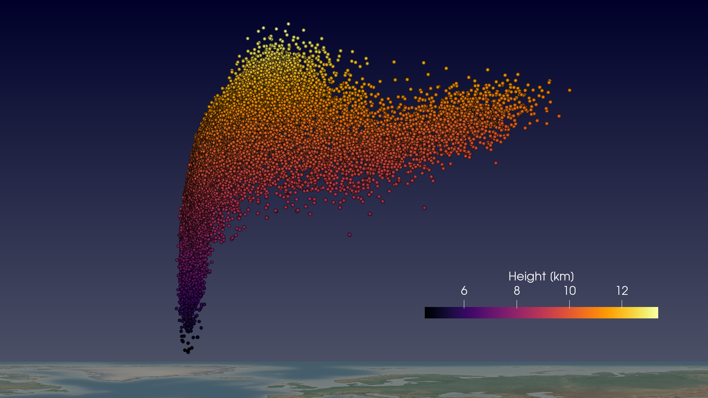
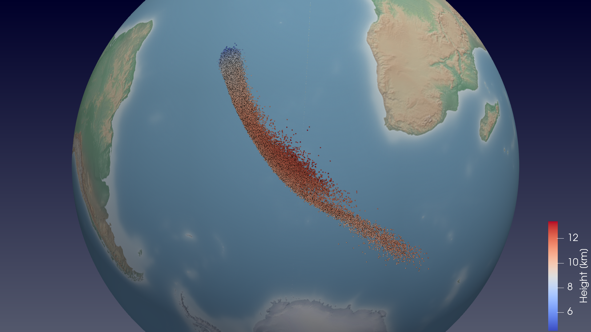

# ParaView Visualization of MPTRAC Output

This project shows how to visualize MPTRAC particle data with ParaView.

## Control Parameters

MPTRAC can generate particle data output in ParaView's native data format, called VTK files.

Please configure the VTK output of MPTRAC using the following control parameters:

| Parameter    | Description                                                |
|--------------|------------------------------------------------------------|
| VTK_BASENAME | basename of the VTK data files                             |
| VTK_DT_OUT   | output time interval [s] of the VTK output                 |
| VTK_STRIDE   | stride of particle output (write only every n-th particle) |
| VTK_SCALE    | vertical scaling factor for heights                        |
| VTK_OFFSET   | vertical offset for heights                                |
| VTK_SPHERE   | 0=Cartesian coordinates, 1=spherical coordinates           |

See the `run.sh` script for an example of how to generate VTK output in Cartesian or spherical coordinates with MPTRAC.

## Loading data into ParaView

Follow these steps to load the VTK data files created by MPTRAC into ParaView:

- load the VTK files: click `File` -> `Open` -> select the `data/atm_plane..vtk` or `data/atm_sphere..vtk` group for Cartesian or spherical coordinates, respectively -> click `Apply`

- set the visualization properties: select `Point Gaussian` for `Representation` -> select the time step and click the `Zoom Closest To Data` button in the toolbar

- select the variable to be plotted under `Coloring`, optionally adjust the color bar range, location, labels, etc.

- adjust `Opacity` and `Gaussian Radius` properties for best visualization of the point data

## Adding a background image of the Earth

You can add a background image showing the Earth in the ParaView visualization:

- For Cartesian data:

  - click on `Sources` -> `Geometric Shapes` -> `Plane` -> `Apply` to add a source representing a plane
  
  - set `Origin` to (-180, -90, 0), `Point1` to (180, -90, 0) and `Point2` to (-180, 90, 0) -> `Apply` to fit the plane to the global data range
  
  - select menu `Filters` -> `Search` -> `Texture Map to Plane` -> `Apply` and select properties `Texture` -> `File` -> `hyp_2048_plane.png` to project a texture image of the Earth onto the plane

- For spherical coordinates:

  - click on `Sources` -> `Geometric Shapes` -> `Sphere` -> `Apply` to add a source representing a sphere
  
  - set `Radius` to 1.0, `Theta Resolution` to 1024, and `Phi Resolution` to 1024 -> `Apply` to adjust the size and shape of the sphere
  
  - select menu `Filters` -> `Search` -> `Texture Map to Sphere` -> `Apply` and select properties `Texture` -> `File` -> `hyp_2048_sphere.png` to project a texture image of the earth onto the sphere
  
  - uncheck `Prevent Seam` -> `Apply` to display the texture image correctly

## Adjust the plot

Various options are available to adjust the ParaView plots:

- adjust the view (camera and zoom) to your needs

- adjust `Axis Grid` and `Orientation Axes Visibility`

- use `View` -> `Color Map Editor` to modify the color bar

- use `Source` -> `Annotation` -> `Text` to add text labels

## Save or load the state

You can save/load the state of ParaView to/from a file to avoid havong to redo all the steps of creating an image:

- use `File` -> `Save State` to save the current state of ParaView to a file

- use `File` -> `Load State` to load a ParaView state from a file

- see `example_plane.pvsm` and `example_sphere.pvsm` for examples of displaying Cartesian and spherical coordinate data

## Saving screenshots

ParaView images can be saved in various file image formats:

- to create high-resolution images of the ParaView output, use `File` -> `Save Screenshot`

- note that the font size of the text labels is fixed, while the image size of the screenshot may vary

- example of a ParaView image with Cartesian coordinates:

- example of a ParaView image with spherical coordinates:

## Creating animations

ParaView can be used to create animations of the data:

- use the `View' -> `Animation View' menu to open the animation view

- select the particle data in the pipeline browser

- change `atm_..` to `camera` in the animation view and click `+`

- use the `Play` button in the toolbar to display the animation

- use `File` -> `Save Animation` to save the animation to disk

- it might work best to save the animation as a series of jpeg files, then use `ffmpeg` to convert the jpeg images into an mp4 video

## Useful links

Some interesting tools for visualizing point data:

- ParaView: https://www.paraview.org/

- Panoply: https://www.giss.nasa.gov/tools/panoply/

- VAPOR: https://www.vapor.ucar.edu/

- VisIt: https://visit-dav.github.io/visit-website/index.html

Simple method to read/visualize point data from csv files:

- https://guides.lw1.at/visualizing-point-clouds/

Information about the VTK file format (i.e. the native file format of ParaView):

- https://examples.vtk.org/site/VTKFileFormats/

- https://www.earthmodels.org/software/vtk-and-paraview/vtk-file-formats

- https://www.visitusers.org/index.php?title=ASCII_VTK_Files

How to add a projection of an image of the Earth on a plane or on a sphere to ParaView:

- https://docs.dkrz.de/doc/visualization/sw/paraview/Filters/earth-texture/index.html

High-resolution images of the Earth:

- https://www.naturalearthdata.com/

Link to CF conventions for saving point data:

- https://cfconventions.org/Data/cf-conventions/cf-conventions-1.10/cf-conventions.html#point-data
