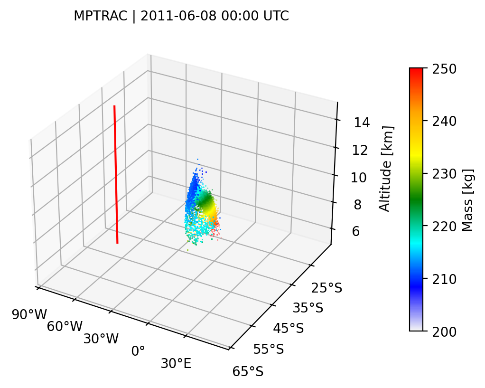
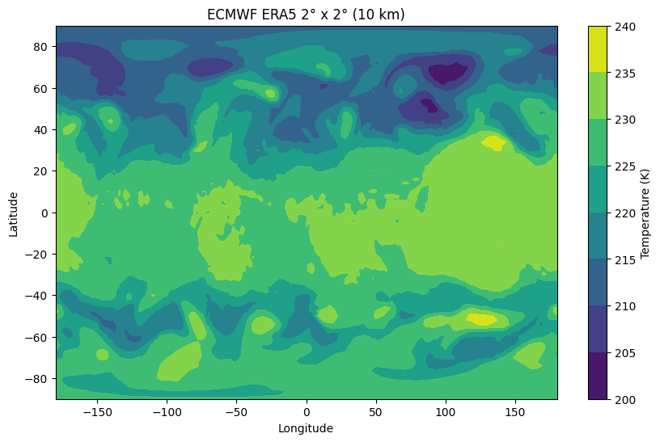
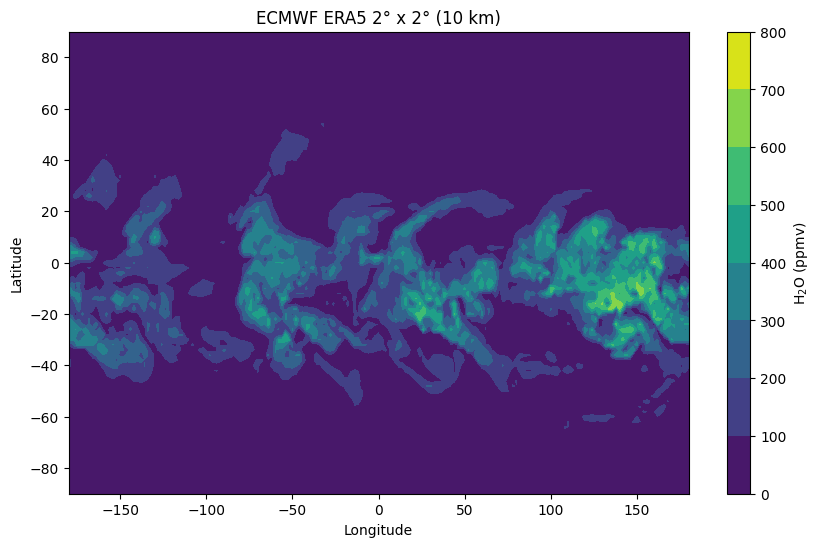
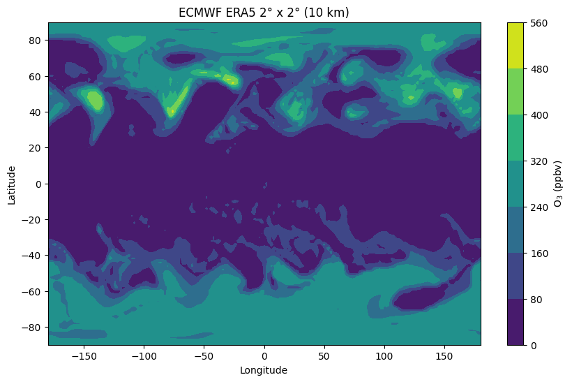

# Python examples 

Here we provide some example Python scripts that can be used to plot
MPTRAC output.

## Preparations

The script `plot.sh` creates and activates a Python virtual
environment (`venv`) in your working directory.

Additionally, it installs the necessary Python modules for data
ingestion and plotting:

```
    pip install basemap basemap-data cartopy matplotlib numpy pandas scipy xarray
```

## Plotting of air parcel and grid output of MPTRAC

Three programs are provided for plotting air parcel and grid output:
`plot_atm.py`, `plot_atm_3d.py`, and `plot_grid.py`.

Call the Python plot scripts with parameter `datadir` (the directory
of the data files) and `plotdir` (the directory where the plots will
be written to), e.g., for `plot_atm.py` it would be:

```
    python ./plot_atm.py ../example/data pythonplots
```

The following images show example results generated using
`plot_atm_3d.py`, illustrating the spatial distribution of air parcels
at different times:

<p align="center"> &emsp; </p>

## Plotting of trajectories and meteo map output of MPTRAC

To plot the trajectory data files created with `atm_select`, call the
Python script `atm_traj.py`:

```
    python3 plot_traj.py
```

Here, a single trajectory on a map is plotted from the data file
`traj_5450.tab`, provided in the directory `data`.

To plot meteo data files created with `met_map`, call the Python
script `plot_met_map.py`:

```
    python3 plot_met_map.py
```

Here, three parameters (O<sub>3</sub>, H<sub>2</sub>O, and
temperature) are plotted versus longitude and latitude from the
datafile `map_era5_2017010817_2_2.tab` provided in the directory
`data`. The met_map file contains data at 10 km altitude. In the
program other altitudes can be chosen by changing the parameter
`level`. However, in order to plot other altitudes, new map files must
be created.

<p align="center"> &emsp;  ; &emsp </p>

## Plot script

Additionally, the shell script `plot.sh` is provided, which creates
all plots at once. The input and output filenames are set in the shell
script and the script itself can be run with:

```
    ./plot.sh
```

The plots will be written to the directory `plots`. A set of reference
plots for comparison is provided in `plots.ref`.
